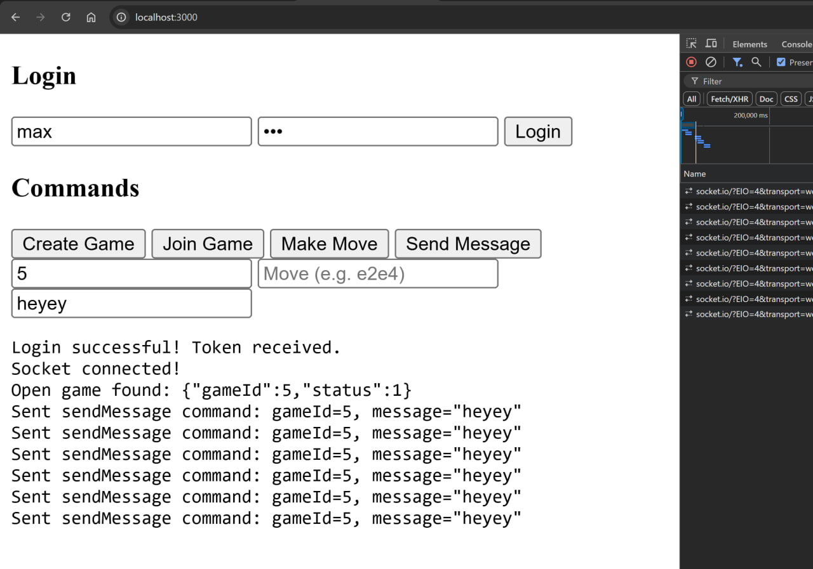
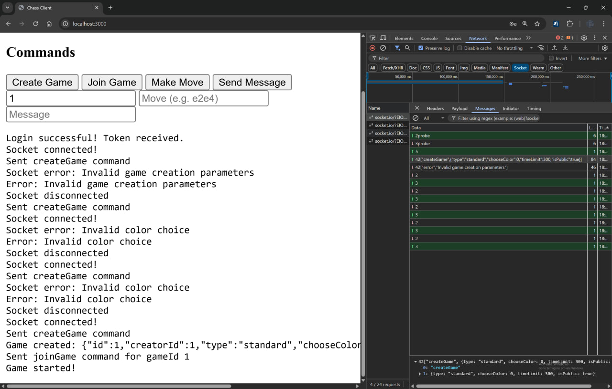

# chess-game-socket-backend

This is a Node.js backend server for a multiplayer chess game with real-time capabilities using WebSockets (`socket.io`). It features user authentication, game management, chat, and move tracking using MySQL and `chess.js` for game logic.

## Features

- JWT-based user authentication
- Realtime chess matches via Socket.IO
- Game state stored in MySQL
- Public/private games and spectating support
- In-game chat system
- Chess logic via [chess.js](https://github.com/jhlywa/chess.js/)

## Installation

```bash
npm install
npm run start
```

## Database Setup

The server initializes the following MySQL tables on startup:

- `users`
- `games`
- `moves`
- `messages`

Make sure you configure MySQL credentials correctly in the source code.

## Demo




## License

© 2025 Max Base
